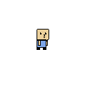

= Nobodies

A tiny memory and reaction-time game made in Godot.

== About

*Nobodies* is a very small game built around a simple question:

> How well can you notice one small change when everything else is moving?

At the beginning of each round, you are shown a group of characters. The screen 
then blinks, the characters move to new positions, 
and *one new character is added*.

Your job is to find the newcomer.

Find them correctly to advance to the next round. Pick the wrong character—or 
run out of time—and you lose.

The characters are all named, and some of them are references to things I like.

== How to Play

. Memorize the characters on screen.
. The screen blinks.
. The characters move and one new character appears.
. Find the new character.
. Repeat until you lose.

The game gets progressively harder as you go.

=== Controls

[cols="1,3"]
|===
| Key | Action

| `R`
| Reset the game
|===

That's it. There aren't exactly a lot of buttons to memorize.

== Play It Yourself

The web version is available through GitHub Pages:

link:https://dr-helicopter.github.io/nobodies/[Play Nobodies]

== Features

* Short-term memory challenge
* Reaction-time challenge
* Increasing difficulty
* Named characters and references
* Works on desktop and mobile
* Web export
* Playable directly through GitHub Pages

== Technical

The game was made with https://godotengine.org/[Godot] and exported for the web.

One of the main reasons for making it was to experiment with the process of taking a Godot game from a local project to an actually playable web build hosted through GitHub Pages.

The game is intentionally small and self-contained.

== Development

This was a silly little project made in roughly *3 days*.

It started primarily as an experiment in:

* Handling different screen sizes
* Exporting a Godot game for the web
* Deploying the result through GitHub Pages

== Status

The core game is complete.

There are still some polish ideas for the future, including:

* Sound effects
* Backgrounds and additional visual polish
* More animations
* General code cleanup

None of these are required to play the game—the important part is that the 
little bastard works.

== Built With

* https://godotengine.org/[Godot]
* GDScript
* GitHub Pages

== License

See the repository for license information.
